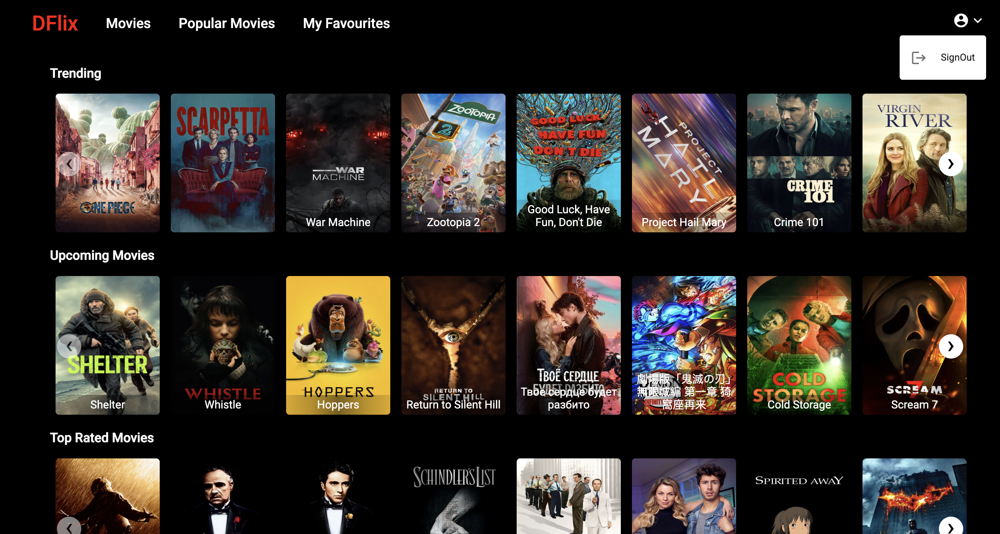
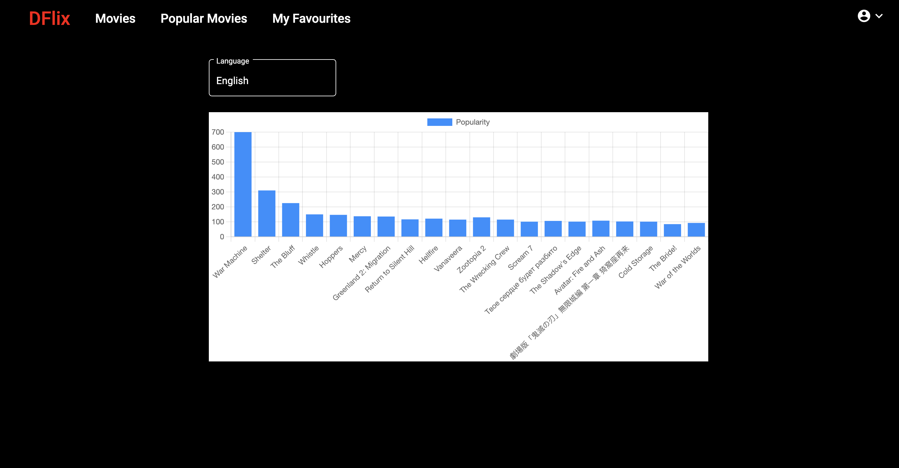
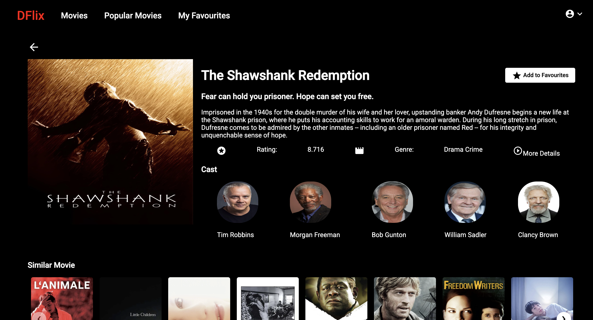
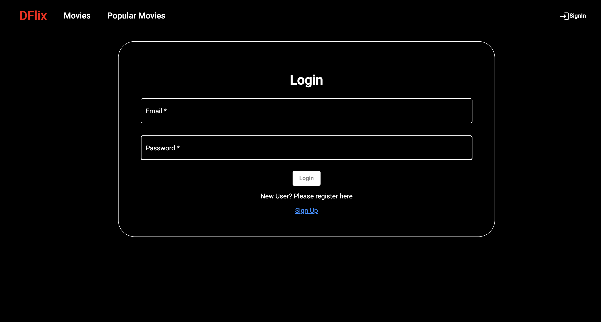

# DFlix

A Netflix-inspired movie discovery app built with Angular and Firebase. Browse trending, upcoming, and top-rated movies, view detailed info with cast, and save your favourites — all backed by the TMDB API.

## Screenshots






## Features

- **Movies Home** — browse trending, upcoming, and top-rated movies in sliders
- **Popular Movies** — visualise movie popularity scores in an interactive bar chart, filterable by language
- **Movie Details** — full movie info including overview, genres, rating, cast, and similar movies
- **Favourites** — save and manage favourite movies (auth required)
- **Authentication** — sign up / sign in via Firebase with form validation and error feedback
- **404 Page** — custom not-found page for unknown routes

## Tech Stack

| Layer          | Technology                |
| -------------- | ------------------------- |
| Frontend       | Angular 13                |
| UI Components  | Angular Material          |
| Charts         | ng2-charts (Chart.js)     |
| Image Slider   | ng-image-slider           |
| Auth & Backend | Firebase (Authentication) |
| Movie Data     | TMDB API                  |

## Project Structure

```
src/app/
├── pages/
│   ├── movies-list/        # Home page — trending, upcoming, top-rated
│   ├── popular-movies/     # Popularity chart with language filter
│   ├── movie-details/      # Individual movie page
│   ├── favourites/         # Saved movies (protected route)
│   ├── signin/
│   └── signup/
├── services/
│   ├── movies.service.ts         # TMDB API calls + favourites state
│   ├── authentication.service.ts # Firebase auth
│   └── notification.service.ts   # Snackbar notifications
└── shared/
    ├── layout/             # Header, Footer
    ├── components/         # Card, Slider, PageNotFound
    └── modals/             # TypeScript interfaces (Movies, User, etc.)
```

## Getting Started

### Prerequisites

- Node.js 16+
- Angular CLI: `npm install -g @angular/cli`

### Installation

```bash
git clone <repo-url>
cd dflix
npm install
```

### Configuration

The app requires two API keys:

1. **TMDB API key** — set in `src/app/constants/urls-constants.ts`
2. **Firebase config** — set in `src/environments/environment.ts`

### Running locally

```bash
ng serve
```

Navigate to `http://localhost:4200/`.

### Build

```bash
ng build
```

Build artifacts are output to `dist/`.

### Tests

```bash
ng test
```

## Deployment

This is a pure client-side SPA and can be deployed to any static host (Vercel, Netlify, Firebase Hosting, etc.).

For Vercel, add a `vercel.json` to handle client-side routing:

```json
{
  "rewrites": [{ "source": "/(.*)", "destination": "/index.html" }]
}
```
